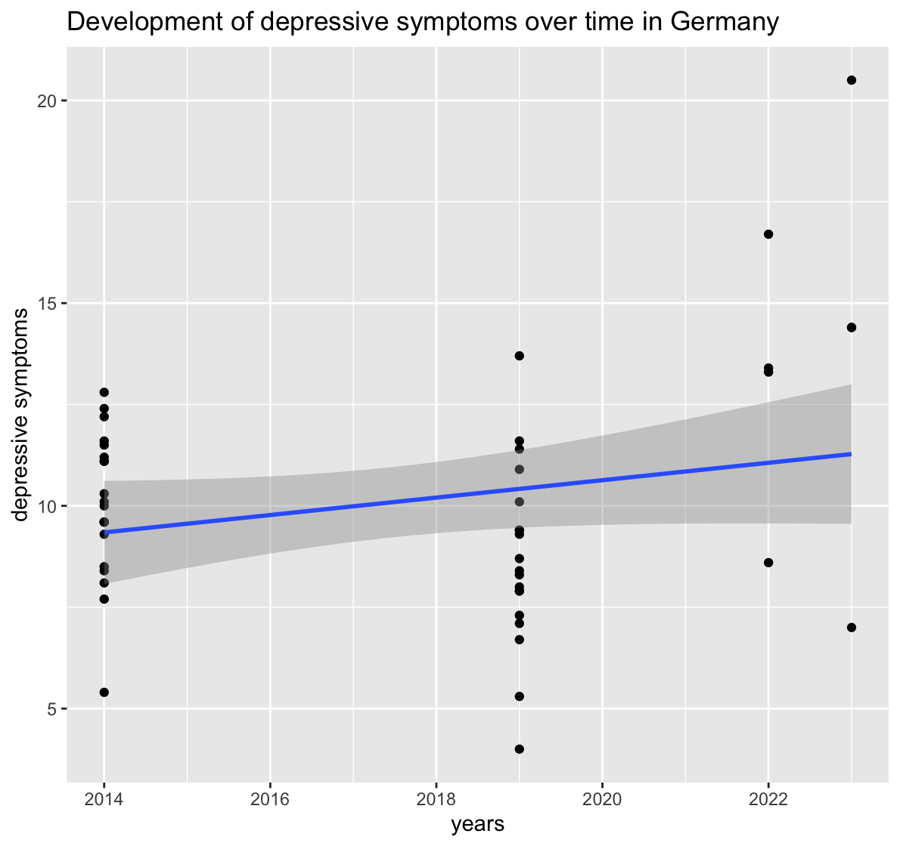
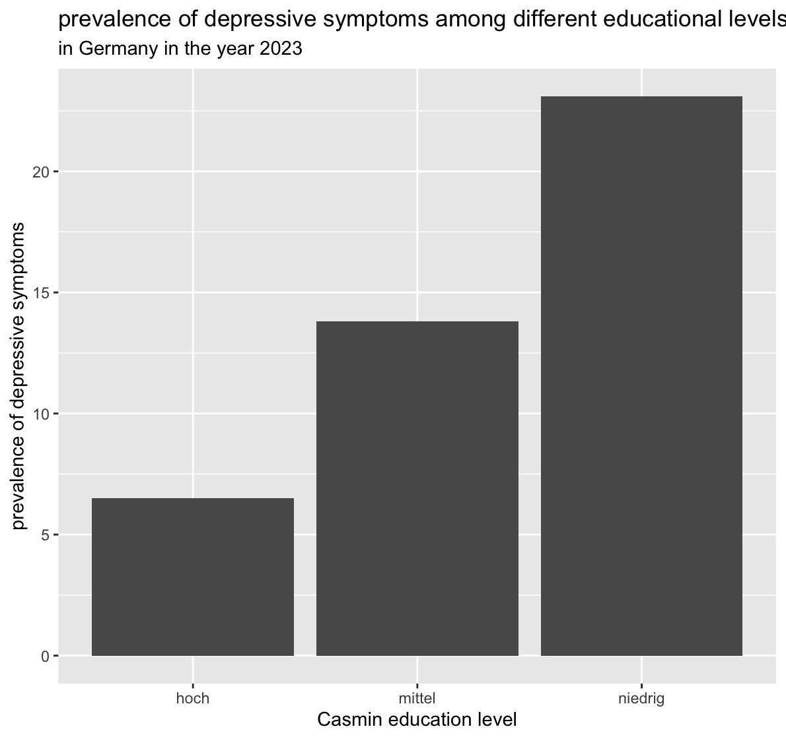

Source and License:

This data is sourced from the the health report of the Robert-Koch-Institut (<https://github.com/robert-koch-institut/Gesundheitsberichterstattung_-_Daten_zu_nichtuebertragbaren_Erkrankungen?tab=CC-BY-4.0-1-ov-file#readme>) and it is publicly available under the CC-BY-4.0 license.

What is in it?

The data set contains health data on non-infectious diseases in the german population. It has 29 columns and 53,036 rows. Each row constitutes an observation of the monthly prevalence of a specific health behavior or illness (physical or mental) in a sample. The variable "Indikator_ID" gives a identifying number to each indicator (ergo the illness or behavior). The variable "Indikator_Name" is the name of the indicator. A detailed description can be found in the ReadMe under indicator on the website (see link above). The variable "Wert" contains the prevalence of the indicator in percent. The simple size is in the variable "Stichprobe", the region is under "Region_Name" and "Bildung_Casmin_Name" describes what level of education the people included in this data have.

Research questions

1.  question proposal: How did depressive symptoms (Indikator_ID = `2040202`) develop over time and do depressive symptoms correlate with social support (Indikator_ID = `1010301`) in different regions of Germany?
2.  question proposal: What are differences in depressive symptoms between people of different educational levels (Bildung_Casmin_Name)? And did depressive symptoms of the most educated group decrease?

Context and target audience:

Mental health problems represent a struggle for affected individuals, their significant others and society. The recent crisis like the pandemic have exacerbated the problem significantly. This data analysis can be the groundwork for public policy and designers of the health problem in Germany. We want to show how depressive symptoms have developed over time and how two prominently assumed resilience factors stand in relation to this development. Building on the results on the analysis one could initiate targeted prevention programs and estimate the effectiveness of social-support-based interventions. The examination of the effect of education

**Initial data analysis:**

Glimpse output:

```         
Rows: 53,036
Columns: 29
$ Indikator_ID                  <dbl> 1010301, 1010301, 1010301, 1010301, 1010301, 1010301, 1010301, 10103…
$ Indikator_Name                <chr> "Soziale Unterstützung (ab 18 Jahre)", "Soziale Unterstützung (ab 18…
$ Kennzahl_ID                   <dbl> 1, 1, 1, 1, 1, 1, 1, 1, 1, 1, 1, 1, 1, 1, 1, 1, 1, 1, 1, 1, 1, 1, 1,…
$ Kennzahl_Name                 <chr> "Soziale Unterstützung", "Soziale Unterstützung", "Soziale Unterstüt…
$ Kennzahl_Definition           <chr> "Anteil der Erwachsenen mit starker sozialer Unterstützung in %", "A…
$ Zeitraum_ISO                  <chr> "2009-01-01--2009-12-31", "2009-01-01--2009-12-31", "2009-01-01--200…
$ Zeitraum_Name                 <chr> "2009", "2009", "2009", "2009", "2009", "2009", "2009", "2009", "200…
$ Geschlecht_ID                 <dbl> 0, 0, 0, 0, 0, 0, 0, 0, 0, 0, 0, 0, 0, 0, 0, 0, 0, 0, 0, 0, 0, 0, 0,…
$ Geschlecht_Name               <chr> "Gesamt", "Gesamt", "Gesamt", "Gesamt", "Gesamt", "Gesamt", "Gesamt"…
$ Alter_ID                      <chr> "00+", "00+", "00+", "00+", "00+", "00+", "00+", "00+", "00+", "00+"…
$ Alter_Name                    <chr> "Alle Altersgruppen", "Alle Altersgruppen", "Alle Altersgruppen", "A…
$ Region_ID                     <chr> "00", "00", "00", "00", "00", "00", "00", "00", "01", "01", "02", "0…
$ Region_Name                   <chr> "Deutschland", "Deutschland", "Deutschland", "Deutschland", "Deutsch…
$ Bildung_Casmin_ID             <dbl> 0, 0, 1, 1, 2, 2, 3, 3, 0, 0, 0, 0, 0, 0, 0, 0, 0, 0, 0, 0, 0, 0, 0,…
$ Bildung_Casmin_Name           <chr> "Gesamt", "Gesamt", "niedrig", "niedrig", "mittel", "mittel", "hoch"…
$ GISD_ID                       <dbl> NA, NA, NA, NA, NA, NA, NA, NA, NA, NA, NA, NA, NA, NA, NA, NA, NA, …
$ GISD_Name                     <chr> NA, NA, NA, NA, NA, NA, NA, NA, NA, NA, NA, NA, NA, NA, NA, NA, NA, …
$ Berufliche_Qualifikation_ID   <dbl> NA, NA, NA, NA, NA, NA, NA, NA, NA, NA, NA, NA, NA, NA, NA, NA, NA, …
$ Berufliche_Qualifikation_Name <chr> NA, NA, NA, NA, NA, NA, NA, NA, NA, NA, NA, NA, NA, NA, NA, NA, NA, …
$ Standardisierung_ID           <dbl> 0, 3, 0, 3, 0, 3, 0, 3, 0, 3, 0, 3, 0, 3, 0, 3, 0, 3, 0, 3, 0, 3, 0,…
$ Standardisierung_Name         <chr> "beobachtet", "altersstandardisiert", "beobachtet", "altersstandardi…
$ Wert                          <dbl> 32.6, 32.4, 28.4, 30.0, 34.8, 32.9, 35.8, 35.8, 34.4, 34.4, 34.0, 33…
$ Unteres_Konfidenzintervall    <dbl> 31.8, 31.6, 26.9, 28.4, 33.6, 31.7, 34.4, 34.1, 30.1, 30.1, 28.7, 28…
$ Oberes_Konfidenzintervall     <dbl> 33.4, 33.2, 30.0, 31.7, 35.9, 34.2, 37.3, 37.5, 38.9, 39.0, 39.8, 38…
$ Fälle                         <dbl> NA, NA, NA, NA, NA, NA, NA, NA, NA, NA, NA, NA, NA, NA, NA, NA, NA, …
$ Stichprobe                    <dbl> 20418, 20418, 4963, 4963, 10319, 10319, 5104, 5104, 737, 737, 459, 4…
$ Unsicherheit                  <dbl> 0, 0, 0, 0, 0, 0, 0, 0, 0, 0, 0, 0, 0, 0, 0, 0, 0, 0, 0, 0, 0, 0, 0,…
$ Anmerkung                     <chr> NA, NA, NA, NA, NA, NA, NA, NA, NA, NA, NA, NA, NA, NA, NA, NA, NA, …
$ Datenstand                    <date> 2024-11-20, 2024-11-20, 2024-11-20, 2024-11-20, 2024-11-20, 2024-11…
```

Summary of key variables

Since the data includes a lot of different indicators which are not seperated into columns but spread over different rows, one can only really calculate the amount of data points at this point (basically, all unique entries of Indikator_Name could be an own column). Calculating means or standard deviations across the indicators does not provide real meaning here. The data is not transformed to make unique entries of Indikator_Name into columns as we are only choosing a small subset of values of Indikator_Name and matching rows would be hard (for example because of differing age categories across indicators). It would also inflate the number of columns.

Bildung_Casmin_Name (education level):

-46% of entries are missing

-the variable has four categories: Gesamt (all education types included), hoch (high education), mittel (medium education) and niedrig (low education)

```         
  Bildung_Casmin_Name     n
  <chr>               <int>
1 Gesamt              25370
2 hoch                 1110
3 mittel               1110
4 niedrig              1110
5 NA                  24336
```

Missing values:

```{r}
library(readr)
library(tidyr)
library(dplyr)

df <- read_tsv("GBE_Indikatoren_nichtuebertragbarer_Erkrankungen.tsv")

key_vars <- c(
 "Kennzahl_Name", "Zeitraum_Name", "Region_Name",
 "Geschlecht_Name", "Alter_Name", "Bildung_Casmin_Name",
 "Wert", "Unteres_Konfidenzintervall", "Oberes_Konfidenzintervall",
 "Stichprobe", "Unsicherheit"
)

df %>%
 select(all_of(key_vars)) %>%
 summarise(across(everything(), ~ sum(is.na(.)))) %>%
 pivot_longer(everything(), names_to = "Variable", values_to = "N_Missing") %>%
 mutate(Pct_Missing = round(N_Missing / nrow(df) * 100, 1)) %>%
 print(n = Inf)
```

There are a lot of values missing for confidence intervals. This is partly explained by "Unsicherheit" being to low or the indicator not being an estimate based on a sample. That also explains the missing values in sample.

Gender:

```{r}
df %>%
   group_by(Geschlecht_Name) %>%
   summarise(
     N      = n(),
   ) %>%
   print()
```

There seems to be roughly similar depth in data for women and men.

Age:

```{r}
df %>%
   group_by(Alter_Name) %>%
   summarise(
     N      = n(),
   ) %>%
   print()
```

Since categories are inconsistent, this is difficult to interpret.

Education:

```{r}
df %>%
   group_by(Bildung_Casmin_Name) %>%
   summarise(
     N      = n(),
   ) %>%
   print()
```

Region_Name:

```{r}
df %>%
   group_by(Region_Name) %>%
   summarise(
     N      = n(),
   ) %>%
   print(n=60)
```

This shows that the data contains German states (majority), European countires and other (West, Ost, ...). For our analyses we expect to mainly use German data on a federal and state level.

Stichprobe:

```{r}
df %>%
  summarise(
    Mean   = round(mean(Stichprobe, na.rm = TRUE), 2),
    SD     = round(sd(Stichprobe, na.rm = TRUE), 2),
    Median = round(median(Stichprobe, na.rm = TRUE), 2),
    Min    = round(min(Stichprobe, na.rm = TRUE), 2),
    Max    = round(max(Stichprobe, na.rm = TRUE), 2)  
  ) %>%
  print()

```

Unsicherheit:

```{r}
df %>%
   group_by(Unsicherheit) %>%
   summarise(
     N      = n(),
   ) %>%
   print()
```

Unsicherheit is fairly small for most rows but should be checked for relevant indicators regardless.

Plots:

This is a simplifies trend of the development of depressive symptoms over time in Germany. For simplification purposes only the observations of all genders and ages were used!

{width="505"}

This image implicates that the premise of the second research question might hold true: Depressive symptoms could differ among different education levels in Germany, but the observations were selected for simplification purposes! (as above)

{width="510"}

Quality issues:

-one variable has the wrong data type (Zeitraum_Name) RESOLVED: By creating Start_Beobachtungszeitraum and Ende_Beobachtungszeitraum from Zeitraum_ISO we got the information we need and it is often times more precise than in Zeitraum_Name. Converting Zeitraum_Name to date would result in some form of data loss as it is in varying formats (e.g. 2024/25, 2009).

```{r}
unique(df$Zeitraum_Name)
```

\- many variables are double although integer would be sufficient ADDRESSED in rki_Skript

-there is no variable uniquely identifing each row/observation ADDRESSED in rki_Skript

-some variables have more missing values then existing values (e.g. Fälle, Unteres_Konfidenzintervall) –\> Solution: We will our analysis on measures that can be calculated with what is given, whilst reflecting whether the selection of sepcific observations might result in a bias

-because of the use of indicators system the variable "Indikator_ID" basically contains different attributes/variables; that is unhandy to work with

-Age categories are inconsistent, so depending on what indicators we want to combine into an analysis, we might not be able to use Age as a control variable

-Bildung_Casmin_Name is not available across all indicators so we might not be able to use that as a control variable depending on the analysis.

-Sample size is really small for some indicators. We will have to keep in mind to check the sample size for relevant indicators and calculate power

-the variable Zeitraum_Name appears to contain some observations with two years (e.g. 2024/25) —\> it appears that no observation relevant to our analysis contains this, so we will leave the variable as is

Solution: (adressed in the individual bullet points)

Analysis plan:

1\.

Variables:

- Indikator_ID

- time variable depends on whether the time intervals are entire years, let's see:

```{r}
rki_data_1_1 <- df %>% 
  filter(Indikator_ID == '2040202' | Indikator_ID == '1010301')

unique(rki_data_1_1$Zeitraum_ISO)
```

Let's see whether Zeitraum_Name is sufficient then:

```{r}
unique(rki_data_1_1$Zeitraum_Name)
```

-\> it is, so it is easiest to go with that column

- Geschlecht_ID and Alter_ID as controlling variables

- Region_ID

- Standardisierung_ID: There are age-adjusted and raw data. As we, in a part of our analyses, want to control for age, we should only use the age-adjusted data if the age ranges are rather wide. So let's look at that:

```{r}
unique(rki_data_1_1$Alter_Name)
```

-\> they are, so we will focus on age-adjusted data (Standardisierung_ID == 3)

- Stichprobe

- Unteres_Konfidenzintervall

- Oberes_Konfidenzintervall

- Wert

- Unsicherheit

Analytical approach:

1.  Data cleaning
2.  Data transformation
3.  See if all data can be used (Unsicherheit)
4.  See if there is a similar Stichprobengröße for the different subgroups
5.  Correlation between age-adjusted depression and social support over time
6.  Zoom in on potential differences for gender (so seperate correlations for women and men), same for regions
7.  Calculate linear regression with depression as dependent variable and social support, age, gender, and region as independent variables – Edit: Unfortunately, the data only allowed for an analysis with social support with region and another analysis with social support, age and gender
8.  Calculate the analyses with Inverse-Variance Weighting

Cleaning / transformation steps needed: General data cleaning (data types), transform data so that one year is one row (match indicators)

Uncertainties:

- Some sub-groups might get pretty small - if the subgroups vary a lot in size, the Inverse-Variance Weighting might be skewed. But we will cross that bridge when we come to it.

- To keep the analytical complexity in a range that I can handle, I will not look at education more closely. It is possible, however, that education moderates the relationship between depression and social support.

2\.

Variables:

- Indikator_ID (ID = `2040202`)

- Casmin_Bildung_Name (education level: high, medium, low or general population)

- Wert (the value of depressive symptoms measured in a population chunk)

- Zeitraum_Name (the year)

- Stichprobe (the sample size of each observation)

Analytical approach:

- calculate point estimators for the prevalence of depressive symptoms of each education level group for each year (so that we can confidently use an unpaired-test)

- calculate confidence intervalls for each point and see whether they overlap

- Calculate point guessers for depressive symptoms of the general population for each year, Calculate the differences between the high education group and general education group for each year–\> did the difference decline over the years?

- Maybe calculate the correlation between a socio-economic indicator and depressive symptoms: if the effect is smaller than the one for education then we can estimate a minimum of the education-depression-correlation that can not be explained by socio-economic factors

Cleaning / transformation steps needed:

- isolate the observations where the variable "Bildung_Casmin_Name" is either high ("hoch"), medium ("mittel") or low ("niedrig") and where depressive symptoms are given

- remove the observations that are not age-standardized

- calculate weighted average for values of each year and education level

- isolate the observations where the variable "Bildung_Casmin_Name" is either general ("Gesamt") and where depressive symptoms are given

Uncertainties:

- relevant observations are only present for the years 2014, 2019, 2022 and 2023; thus fluctuations over few years might distort the picture
- We only have group statistics and not individual statistics, so we can not make t-tests as they are based on the knowledge of the distribution of values, but we can still calculate confidence intervals
- there are no relevant indicators or demographic measures which were measured at the same time, so we can not control for a variable like socio-economic stability. That means that an important possible confounder can not be properly accounted for
- we assume that the observations are independent of each other. But maybe people get to this study because family members reccommend it (for example), so some data points might be not independent which would affect the analysis

Workflow organization:

Code style: tidyverse, enforced with styler linter (not included in the project yet, WOP)

Packages: number of packages should be kept at a minimum to avoid conflicts between packages but every collaborator can use new packages at their own may.

If we have to write a relevant amount of functions for our analysis we might sum them up in a package and add instructing comments via roxygen2.

Planned packages:

Git workflow: People should work on individual branches, named after the author, to reduce conflicts wherever it is practical. Exceptions can be made after getting permission from the branch creator or when meeting up in one place; continue the common practice to let the partner confirm the pull request. Once the pull request is accepted the branch should be deleted.

We will generally not work on main. Exception: if we work together in the moment or ask the partner for approval.

If a mistake is noticed the partner is informed and the change can be inspected by using the log function and reversed with git restore. If a correction needs to be made, while the current work is unfinished, one might use git stash to save the progress (and recall with git stash pop).

If a merge conflict occurs on a relevant part (e.g. something important for the analysis, not just wordings), the partner is consulted and the better version shall be discussed together. If the partner is unavailable at the time, one should resolve the conflict and add the alternate version, so that the decision can be done later on.

if we notice, that we have to repeat a code snippet a lot we can think of a sensible function to accelerate the analysis. If the use of a function is unclear or prone to mistakes, we will validate the function input (e.g. if/ stop() ).

Gitignore: Artefacts from running code will be added to a gitignore file, though it is unclear at this stage what exactly we will include as we do not know the entire requirements of our project just yet.
